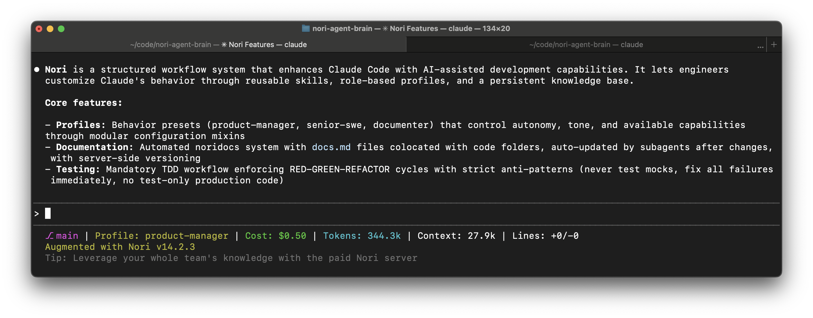

# Nori

**Packaged customization for coding agents. Put Claude Code in hyperdrive.**

Coding agents are magical, but they are general-purpose tools that need to be customized for your team. Otherwise, as you scale they will produce risky slop. Customizing agents is time-intensive and the landscape changes daily. Nori provides packaged customization that provides your engineering team the path to velocity and quality at scale.



## The Problem

Generic coding agents work great initially but degrade with scale:

- **Documentation debt compounds**: AI needs context. Without great docs, teams lose track of decisions, architecture, and the intention behind changes. When coding agents are doing most of the coding, docs cannot be an afterthought.
- **Shortcuts accumulate**: Without enforced processes, agents skip TDD, take debugging shortcuts, and claim success without verification.
- **Patterns diverge**: Different engineers get different patterns from the agent. No shared context means inconsistent outputs.
- **Configuration burden**: Every team rebuilds the same customizations. Prompts, workflows, and guardrails require constant maintenance.

The result: **slop that accumulates faster than your ability to manage it.**

## How Nori Fixes This

Nori provides three core capabilities that transform coding agents from generic assistants into team-aligned tools:

### 1. Documentation: Living Docs That Evolve With Your Code

**The problem**: Agents need AI-scale docs, and docs have always been an afterthought. Without it, context evaporates between sessions. At best, teams waste time re-explaining decisions. At worst, intention is lost and bad decisions are made.

**Nori's solution**:

- **Docs automation**: Automatically create and maintain `docs.md` files throughout your codebase. Generate local documentation with `initial-documenter` and maintain docs with `change-documenter` subagents that automatically write updates as you build.
- **Zero manual effort**: Documentation stays synchronized with code automatically
- **Nori server (paid)**: Server-side knowledge base with conversation capture, memorize/recall tools, and multi-strategy search (keyword + fuzzy + vector)

**Result**: Your team's institutional memory becomes your coding agent's memory. No more repeated explanations.

### 2. Tests: Process Enforcement That Prevents Shortcuts

**The problem**: Coding agents are behaviorally expeditious. They skip verification steps. Unless directed otherwise, they write tests after implementation, take debugging shortcuts, and claim success without proof.

**Nori's solution**:

- **TDD skill**: Enforces red-green-refactor cycle. Write failing test → verify it fails → minimal code → verify it passes → refactor
- **Testing anti-patterns skill**: Catches common mistakes like testing mocks instead of behavior
- **Systematic debugging**: Four-phase framework (root cause investigation → pattern analysis → hypothesis testing → implementation)
- **Root-cause tracing**: Backward tracing through call stacks to find original triggers, not symptoms
- **Mandatory verification**: Claude must verify tests fail correctly and pass correctly—no skipping steps

**Result**: Code quality stays high at scale. No shortcuts, no unverified claims, no technical debt from "tests later."

### 3. Profiles: Role-Based Customization Out of the Box

**The problem**: Coding agents are being used by more and more contributors, not just your best engineers. This creates obvious risk as different team members have varying skills and knowledge of best practices. Senior engineers want efficiency, product managers need guidance. Every team will be forced to build these guardrails from scratch.

**Nori's solution**:

- **Pre-built profiles** with proven patterns for common roles:
  - `senior-swe`: High-confirmation co-pilot mode, extensive planning leaning on the knowledge of the engineer
  - `product-manager`: Full autonomy with frequent commits, technical guidance without hand-holding
  - `documenter`: Specialized behavior focused on documentation
- **Mixin architecture**: Profiles compose from modular mixins (`_base`, `_docs`, `_swe`) for easy customization
- **One command to switch**: `npx nori-ai switch-profile <name>` or use `/switch-nori-profile` in conversation
- **Extensible**: Create custom profiles by combining mixins or modifying built-in profiles

**Result**: Teams get role-appropriate behavior immediately. No configuration burden, no rebuilding common patterns.

## Features

### Free Tier: Local MCP Package

_Enhances Claude Code with process enforcement and systematic workflows—no backend required._

- **6-checkpoint development workflow**: Setup verification → research → plan approval → TDD cycle → implementation → verification
- **32+ engineering skills**: Step-by-step instructions for TDD, debugging, code review, git workflows, architecture decisions
- **3 built-in profiles**: senior-swe, product-manager, documenter
- **Real-time status line**: Git branch, active profile, token usage, conversation cost
- **Slash commands**: Quick access to workflows (`/nori-info`, `/nori-debug`, `/initialize-noridocs`, `/switch-nori-profile`)
- **Specialized subagents**: codebase-locator, codebase-analyzer, codebase-pattern-finder, web-search-researcher
- **Local noridocs**: Automatic documentation with change-documenter and initial-documenter subagents

### Paid Tier: + Shared Documentation Server

_Team documentation server that captures, organizes, and surfaces institutional knowledge automatically._

- **Web UI**: Browse, search, and manage documentation artifacts with full markdown editing
- **Living documentation system**: Automatically updates as your codebase evolves—docs.md files stay synchronized with code changes
- **Automatic conversation capture**: Git-style hooks capture full conversation summaries with zero manual effort, preserving decisions and reasoning
- **Recipe extraction**: Recipe-writer subagent identifies and documents reusable patterns from successful implementations
- **Multi-strategy search**: Combines keyword, fuzzy, and vector search to surface relevant documentation automatically during conversations
- **Memorize/Recall/UpdateMemory tools**: Claude can save and query team documentation during conversations, eliminating repeated explanations
- **Usage analytics**: Track token usage, costs, and AI impact with daily LLM-generated reports

## Installation

```bash
npx nori-ai@latest install
```

Launch Claude Code from your terminal. Nori features activate automatically.

### Select Your Profile

During installation, choose the profile that matches your role:

- **senior-swe**: High-confirmation co-pilot mode
- **product-manager**: Autonomous execution with technical guidance
- **documenter**: Documentation-focused workflows

Switch profiles anytime:

```bash
npx nori-ai@latest switch-profile <profile-name>
```

Or use `/switch-nori-profile` during a conversation.

## Uninstallation

Remove all Nori features:

```bash
npx nori-ai uninstall
```

Completely remove the package:

```bash
npm uninstall -g nori-ai
```

## Commands

```bash
npx nori-ai              # Install (default)
npx nori-ai install      # Install (explicit)
npx nori-ai uninstall    # Uninstall all features
npx nori-ai help         # Show help message
npx nori-ai check        # Run configuration validation
```

## Requirements

- Node.js 22 or higher
- Claude Code CLI installed

## Special Thanks

- [Simon Willison](https://simonwillison.net/) for inspiration
- [Jesse Vincent](https://blog.fsck.com/) for valuable insight and the superpowers library, which forms the basis of Nori's skills
- The [humanlayer](https://github.com/humanlayer/humanlayer/tree/main) team for great writing on using agents and some subagent implementations
